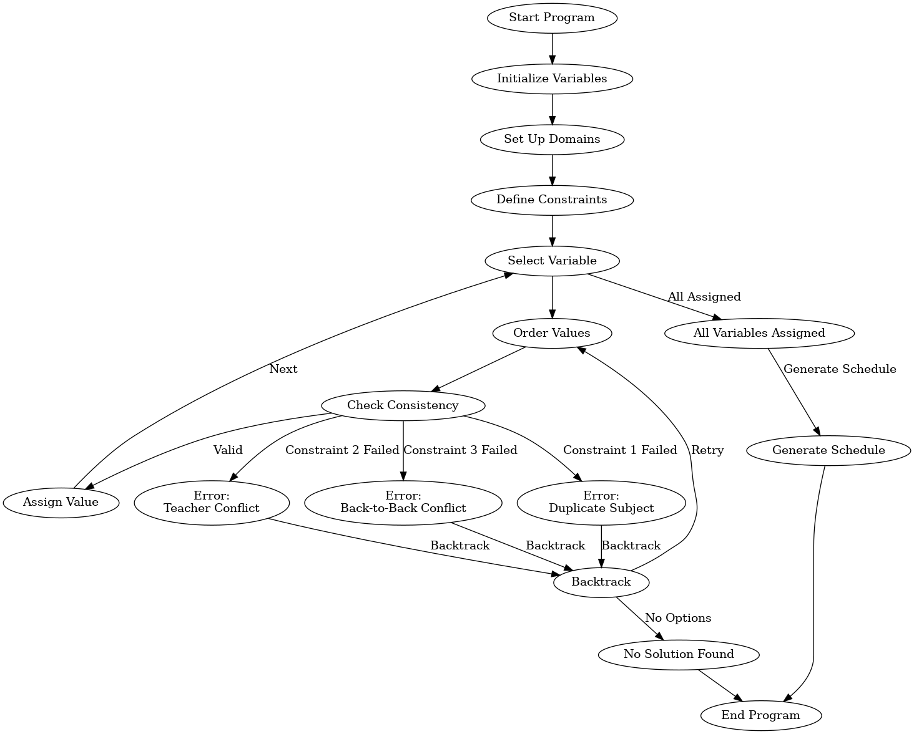

# Constraint Satisfaction Engine
Modeled for Educational Scheduling

[](https://github.com/San68bot/Constraint-Satisfaction-Engine/blob/main/LICENSE)
[](https://www.python.org/)

A constraint satisfaction problem (CSP) solver optimized for generating conflict-free school timetables. Designed as the backend for 100+ schools in India, this engine ensures optimal teacher allocation, workload balancing, and adherence to institutional constraints.

---

## 📖 Overview

This project models school scheduling as a **Constraint Satisfaction Problem (CSP)**—a fundamental concept in artificial intelligence (AI) and operations research. By defining variables (time slots, teachers, subjects) and constraints (teacher availability, subject repetition, workload limits), the engine employs backtracking search with heuristics to generate feasible schedules. Its real-world validation comes from deployment in Indian schools, where it manages multi-grade, multi-section timetables while respecting regional educational policies.

**Core Code**: [`CSP_Engine.py`](https://github.com/San68bot/Constraint-Satisfaction-Engine/blob/main/CSP_Engine.py)

**Constraint Satisfaction Workflow**:



---

## 🧠 Constraint Satisfaction in AI/ML

### Key Concepts
1. **Variables**: Time slots, teachers, subjects, and classes.
2. **Domains**: Valid assignments (e.g., teachers qualified to teach a subject).
3. **Constraints**:
   - **Hard Constraints**: 
     - No teacher assigned to overlapping classes.
     - No duplicate subjects in the same section/day.
     - Teacher workloads ≤ max hours.
   - **Soft Constraints**: 
     - Preferred class assignments (optional).
     - Minimize back-to-back classes for teachers.

### Algorithmic Approach
- **Backtracking Search**: Explores possible assignments recursively.
- **Minimum Remaining Values (MRV) Heuristic**: Prioritizes variables with the fewest legal values to reduce branching.
- **Forward Checking**: Validates constraints incrementally to prune invalid paths early.

### Academic Context
CSPs are widely used in AI for problems ranging from [SAT solvers](https://en.wikipedia.org/wiki/Boolean_satisfiability_problem) to [robotic planning](https://arxiv.org/abs/2010.08563). This project aligns with research on educational scheduling ([Müller et al., 2015](https://link.springer.com/article/10.1007/s10479-015-1800-1)), demonstrating how CSPs can solve NP-hard problems efficiently in practice.

---

## 🚀 Features
- **Automated Schedule Generation**: Produces weekly timetables for multiple grades/sections.
- **Conflict Resolution**: Detects and resolves teacher/hour overflows.
- **Substitution System**: Dynamically replaces unavailable teachers while minimizing disruptions ([`substituteTeacher()`](https://github.com/San68bot/Constraint-Satisfaction-Engine/blob/main/CSP_Engine.py#L353)).
- **Export Capabilities**: Generates CSV and text files for administrative use.
- **Scalability**: Tested on schools with 1,000+ students and 50+ teachers.

---

## ⚙️ Usage

### Setup
1. Clone the repository:
   ```bash
   git clone https://github.com/San68bot/Constraint-Satisfaction-Engine.git
   ```
2. Install dependencies:
   ```bash
   pip install csv
   ```
3. Execution:
   ```bash
   python CSP_Engine.py
   ```
